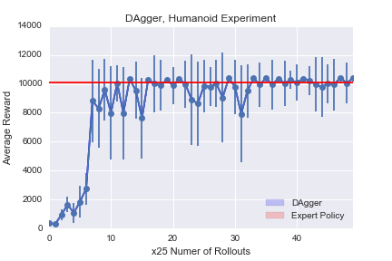

# Just Another DAgger Implementation

DAgger is a reinforcement learning (imitation learning, to be exact) algorithm that uses data aggregation techniques to address the states distribution mismatch problem. The detailed algorithm is described in the [paper](https://arxiv.org/abs/1011.0686).

This is my implementation of the DAgger. The code is based on the starter code and olicy function generously provided by the [Berkeley CS294 course](https://github.com/berkeleydeeprlcourse/homework).

In the Humanoid experiment, the goal is to train the humanoid to walk fast forward without falling. Below is the humanoid trained using DAgger.  

The following figure plots the mean reward by DAgger over the iterations in the humanoid experiment. DAgger is able to achieve expert-level performance after a few data aggregation iterations.  

# How to run the code
Run the following command:
``
python run_dagger.py
``

# Dependencies
- Python  
- [TensorFlow](https://www.tensorflow.org/install/) (tested on 1.0.1)  
- [OpenAI Gym](https://github.com/openai/gym)  
- [Mujoco](https://www.roboti.us/index.html) (1.31)

(More coming soon...)
